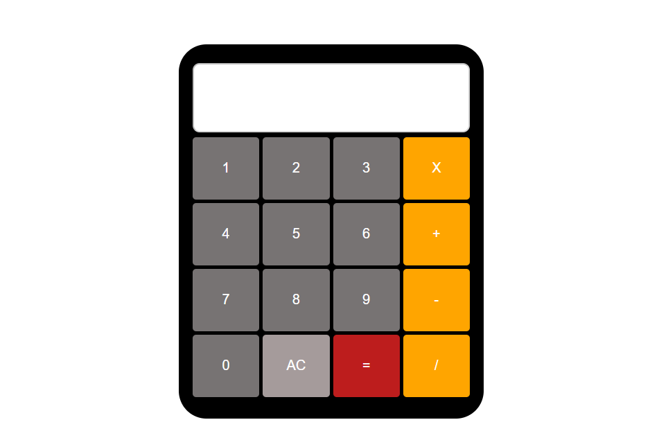
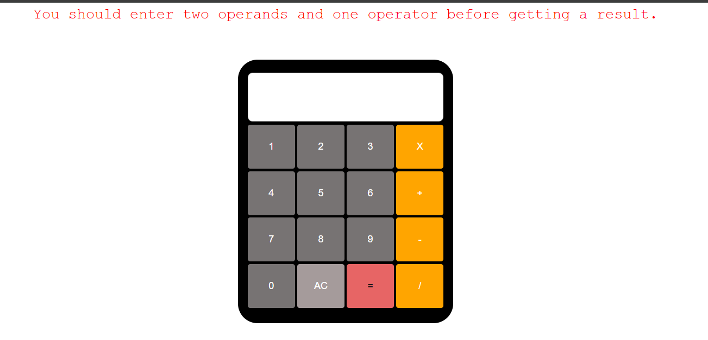

JavaScript Calculator
=====================

Description
-----------

This project is a simple calculator built using **HTML, CSS, and JavaScript**.\
It allows users to perform basic arithmetic operations through an interactive interface.

The main objective of the project was to practice **DOM manipulation, event handling, and state management in JavaScript** while building a functional user interface.

* * * * *

Features
--------

-   Addition, subtraction, multiplication, and division

-   Button interaction with visual feedback

-   Error handling for division by zero

-   Reset functionality

-   Dynamic screen updates

-   Error message display when operations are invalid

* * * * *

Technologies Used
-----------------

-   HTML5

-   CSS3

-   JavaScript 

* * * * *

How the Calculator Works
------------------------

The calculator uses a simple **state management approach** to track user input and operations.

Four main variables control the logic:

-   `firstValue` -- stores the first number entered

-   `operator` -- stores the selected arithmetic operation

-   `lastValue` -- stores the second number entered

-   `isOperatorPressed` -- indicates when the calculator expects the second operand

When a number button is clicked, the `addOperand()` function updates the display and the current value.

When an operator button is clicked, the `addOperator()` function stores the current value as the first operand and waits for the next number.

The `calculateResult()` function performs the operation using a `switch` statement and displays the result on the screen.

* * * * *

Project Structure
-----------------

```
project-folder
│
├── index.html
├── style.css
├── script.js
└── README.md

```

* * * * *

How to Run the Project
----------------------

1.  Clone the repository

```
git clone https://github.com/KaliGix/calculator-js/tree/master/Calculator.git

```

1.  Open the project folder.

2.  Open `index.html` in your browser.

No additional dependencies are required.

* * * * *


Screenshots





What I Learned
--------------

Through this project I practiced:

-   Handling user input through JavaScript event listeners

-   Managing application state

-   Updating the DOM dynamically

-   Structuring JavaScript code into reusable functions

-   Handling edge cases such as division by zero

-   Length of each operand

* * * * *

Possible Future Improvements
----------------------------

-   Support for decimal numbers

-   Keyboard input support

-   Operator precedence (e.g., `5 + 3 × 2`)

-   Improved mobile responsiveness

-   History of previous calculations

* * * * *

Author
------

Created by **Kali** as part of my learning process in JavaScript and front-end development.
